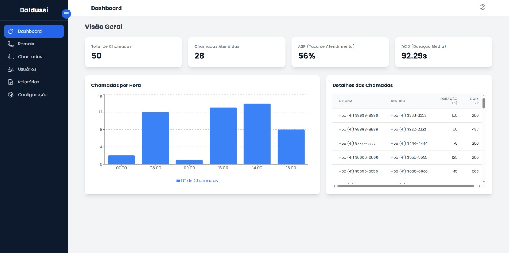

# Dashboard de Telefonia - Case Técnico Baldussi Telecom

Este projeto é uma aplicação web full-stack desenvolvida como parte do processo seletivo da Baldussi Telecom. A aplicação consome dados de chamadas telefônicas, armazena-os em um banco de dados e exibe métricas relevantes em um dashboard interativo e seguro.

## Screenshot do Projeto

 

## Funcionalidades

-   **Autenticação Segura:** Sistema de login com tokens JWT para proteger os dados.
-   **Dashboard de Métricas:** Visualização de KPIs essenciais (Total de Chamadas, Chamadas Atendidas, ASR, ACD).
-   **Análise Temporal:** Gráfico de barras com o volume de chamadas por hora.
-   **Tabela Interativa:** Tabela com detalhes das chamadas e filtro interativo a partir do gráfico.
-   **Interface Refinada:** Layout com sidebar retrátil, dropdown de usuário e design inspirado na identidade visual da empresa.
-   **Ambiente Containerizado:** Aplicação 100% conteinerizada com Docker, garantindo portabilidade e facilidade de execução.

## Stack de Tecnologias

-   **Backend:** Python, FastAPI, SQLAlchemy (Async), PostgreSQL, Alembic.
-   **Frontend:** React, TypeScript, Vite, Tailwind CSS, Axios, Recharts.
-   **Infraestrutura:** Docker, Docker Compose, Nginx.
-   **Testes:** Pytest com banco de dados de teste em memória (SQLite).

## Como Executar o Projeto

Para executar a aplicação, é necessário ter o **Docker** e o **Docker Compose** instalados (recomenda-se o Docker Desktop).

1.  **Clone o repositório:**
    ```bash
    git clone https://github.com/christopherprodrigues/dashboard-telefonia
    cd dashboard-telefonia
    ```

2.  **Crie o arquivo de ambiente:**
    Copie o arquivo `.env.example` para um novo arquivo chamado `.env`.
    ```bash
    cp .env.example .env
    ```

3.  **Suba os containers:**
    Na raiz do projeto, execute o comando:
    ```bash
    docker-compose up --build
    ```
    Aguarde os containers serem construídos e iniciados. O processo pode levar alguns minutos na primeira vez.

4.  **Acesse a aplicação:**
    -   **Dashboard (Frontend):** [http://localhost:5173](http://localhost:5173)
    -   **Documentação da API (Backend):** [http://localhost:8000/docs](http://localhost:8000/docs)

    *Para usar a aplicação, crie um usuário através da documentação da API (`POST /api/users/`) e então faça o login no dashboard.*

## Rodando os Testes

Com os containers em execução, abra um novo terminal e execute o seguinte comando para rodar os testes do backend dentro do container da API:

```bash
docker-compose exec api pytest